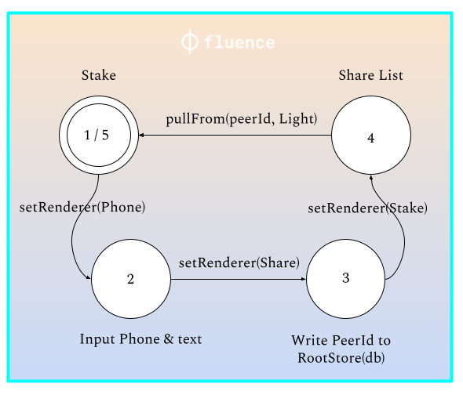

# Reed
crypto tarot app, with spirit bars and p2p pull-based share communication on fluence.network

```
$ cd reed-v4
$ yarn
$ yarn start
```


note: requires [NodeSeed](https://github.com/moskalyk/NodeSeed) server running in tandem to test shareability via phone or email
